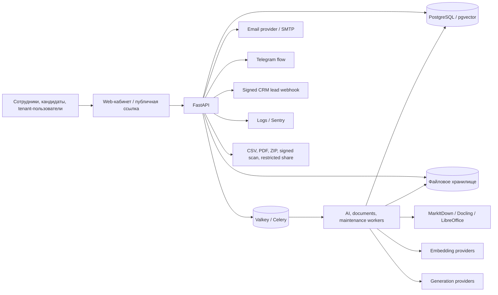

# Карта потоков персональных данных Kamilya LMS

## 1. Назначение и границы

| Поле | Значение |
|---|---|
| Статус | Живой внутренний технический документ |
| Версия | 0.2 |
| Дата составления | 29 сентября 2026 года |
| Проект | Kamilya LMS (`Kamilya-NEW`) |
| Срез кода | ветка `feature/privacy-foundation-20260929`, после `4a73340c` |
| Вид проверки | Статический анализ исходников, Graphify-навигация и сверка проектной карты окружений |
| Не выполнялось | Runtime-readback DEV/production, проверка договоров провайдеров и фактических настроек их кабинетов |

Карта отвечает на четыре практических вопроса:

1. откуда Kamilya получает данные;
2. где и для какой цели они обрабатываются и сохраняются;
3. кому или какому внешнему контуру они могут быть переданы;
4. какое действие требуется на границе: полные данные, минимизация, исключение
   поля, агрегирование, маскирование или запрет.

Это не перечень обязательной маскировки всех данных. Для штатной работы внутри
tenant полные значения нужны уполномоченным ролям. Основные механизмы защиты там
— tenant isolation, RLS, role/capability checks, reporting scope и аудит.
Маскирование рассматривается только для конкретной поверхности, где получателю
не требуется полное значение.

## 2. Правило выбора действия

| Действие | Когда применяется в Kamilya |
|---|---|
| `FULL` | Уполномоченная роль выполняет необходимый бизнес-процесс внутри своего tenant |
| `OMIT` | Поле не нужно роли или операции и не должно включаться в ответ/файл вообще |
| `AGGREGATE` | Нужна статистика, а не данные конкретного человека |
| `REDACT` | Технический текст, лог или диагностика могут случайно содержать значение |
| `MASK` | Частичное значение действительно нужно для узнавания, но полное не требуется |
| `DENY` | Роль, tenant, объект, цель или канал не разрешены |
| `SYNTHETIC` | DEV, demo и автоматические тесты не требуют реальных клиентских значений |
| `HASH` | Исходное значение после проверки или сопоставления не требуется и не должно восстанавливаться |

Принцип для основного кабинета:

> В разрешённом tenant-процессе данные выдаются полностью в минимально
> необходимом составе. За пределами полномочий доступ запрещается. Маскирование
> не заменяет RBAC, RLS и ограничение выборки.

## 3. Логическая схема



Graphify подтвердил связи `record_processing()` с users/staff-import/admin
адаптерами, CSV-export с `User`, `Enrollment` и `QuizAttempt`, а AI generation —
с document, job, pipeline, course и evidence-engine модулями. Направление и
состав каждого существенного потока ниже дополнительно проверены в исходниках.

## 4. Классы данных

| Код | Класс | Примеры |
|---|---|---|
| `D01` | Идентификационные | имя, фамилия, tenant/user/candidate ID |
| `D02` | Контактные | рабочий email, телефон, Telegram ID |
| `D03` | Трудовые и организационные | табельный номер, должность, подразделение, дата приёма, активность |
| `D04` | Аутентификация и доступ | password hash, refresh-token hash, OTP/PIN hash, capability-token hash, IP, user-agent |
| `D05` | Учебная история | назначения, прогресс, попытки, ответы, баллы, время, завершение |
| `D06` | Доказательства обучения | immutable event, подтверждение, PDF/ZIP, подпись, скан, решение методиста |
| `D07` | Кандидаты | ФИО, email/телефон, согласие, ответы, результат, срок хранения |
| `D08` | Исходные материалы | загруженные PDF/DOCX/XLSX/CSV, распознанный текст, chunks, embeddings |
| `D09` | Коммуникации | приглашение, напоминание, support subject/message, delivery status |
| `D10` | Маркетинговый lead | контакт, организация, UTM/referrer, заявка |
| `D11` | Техническая телеметрия | opaque IDs, этапы job, latency, error category, release/runtime state |

## 5. Карта продуктовых потоков

Статус `CODE VERIFIED` означает подтверждение по текущему исходному коду, а не
фактическую проверку конкретного развернутого окружения.

| ID | Поток и цель | Данные | Получатель/хранилище | Текущий контроль | Решение по раскрытию | Статус и evidence |
|---|---|---|---|---|---|---|
| `DF-01` | Регистрация tenant и первого администратора | `D01`, `D02`, `D04`, `D10` | PostgreSQL; audit; CRM outbox при включённой интеграции | проверка входных данных, tenant creation, OTP/session | В кабинете `FULL`; CRM получает только утверждённый lead payload; посторонним `DENY` | `CODE VERIFIED`: `modules/tenants/router.py`, `modules/tenants/crm_outbox.py` |
| `DF-02` | Вход, refresh и переключение активной роли | `D01`, `D04`, частично `D11` | PostgreSQL sessions; httpOnly cookie; access token в памяти browser | token validation, allowlisted session, tenant context, secure cookie | Значения credentials никогда не отображать; в хранилище `HASH` для refresh token; журналам `REDACT` | `CODE VERIFIED`: `modules/auth/service.py`, `browser_session.py`, web `lib/auth.ts` |
| `DF-03` | Создание и изменение сотрудника вручную | `D01`–`D03` | tenant-scoped `users` и связанные структуры в PostgreSQL | methodologist/superadmin role, ownership checks, RLS, processing ledger | Уполномоченному методисту `FULL`; другим ролям `OMIT` или `DENY`, а не маска | `CODE VERIFIED`: `modules/users/staff_import_router.py`, `privacy_control` |
| `DF-04` | Excel/CSV import сотрудников | `D01`–`D03`, исходный файл | API preview, временный/persistent blob, PostgreSQL import session и users | MIME/size/parser validation, mapping, tenant ownership, retention task | Preview и commit методисту `FULL`; другим ролям `DENY`; DEV/test `SYNTHETIC` | `CODE VERIFIED`: `modules/staff_import_sessions`, `modules/users/staff_import_*` |
| `DF-05` | Приглашение сотрудника и email OTP | `D01`, `D02`, `D04`, `D09` | PostgreSQL invitation/OTP; email provider; browser session | expiring token, email-control OTP, retry categories, token/session checks | Адресату передаётся необходимый `FULL` payload; в логах `REDACT`; токены хранить как hash там, где исходник после выдачи не нужен | `CODE VERIFIED`: `modules/users/invitations_service.py`, `core/email.py` |
| `DF-06` | Назначение курса, программы или цикла | `D01`, `D03`, `D05` | PostgreSQL enrollments/rules/paths/cycles; optional notification | tenant ownership, role checks, reporting scope, immutable history | Методисту и ответственному руководителю `FULL` в их scope; вне scope `DENY` | `CODE VERIFIED`: enrollments, learning_paths, learning_cycles, training_rules |
| `DF-07` | Прохождение уроков и тестов | `D01`, `D05` | PostgreSQL progress, attempts and answers | assignment access, tenant context, published release binding | Самому обучающемуся и разрешённым отчётным ролям `FULL`; другим `DENY` | `CODE VERIFIED`: progress, quizzes, enrollment modules |
| `DF-08` | Журнал обучения и внутренний CSV | `D01`–`D03`, `D05` | JSON/CSV из PostgreSQL в browser | admin/methodologist/superadmin, tenant filter, reporting scope, no-store | Для штатного кадрового/методистского процесса `FULL`; не маскировать автоматически | `CODE VERIFIED`: `modules/training_log/router.py`, service/repository |
| `DF-09` | Подтверждение прохождения, PDF/ZIP и подписанный скан | `D01`, `D05`, `D06` | PostgreSQL immutable evidence; file storage; downloadable PDF/ZIP | event/version binding, SHA-256, step-up, methodologist review, tenant checks | Участникам процесса `FULL`; неподписанным ролям `DENY`; пакет не маскировать без отдельного назначения | `CODE VERIFIED`: `modules/training_evidence`, `modules/evidence_export` |
| `DF-10` | Restricted public evidence share | `D01`, `D05`, `D06` | materialized PDF/ZIP bytes в PostgreSQL; получатель с capability token | token hash, expiry, download cap, revoke, rate limit, package SHA-256 | Контролируемое `FULL` раскрытие конкретного пакета по явному действию методиста; generic `DENY` при любой проверке | `CODE VERIFIED`: `training_evidence/share_service.py`, public export route |
| `DF-11` | Кампания оценки кандидатов | `D01`, `D02`, `D04`, `D07` | PostgreSQL; public capability/PIN exchange; CSV результата | tenant RLS, token/PIN hashes, consent, expiry/lockout, bounded retention | Кандидату — только его attempt; методисту tenant — `FULL`; после retention прямые идентификаторы удаляются | `CODE VERIFIED`: `modules/candidate_assessments` |
| `DF-12` | Загрузка исходного документа курса | `D08`, возможные встроенные `D01`–`D03` | file storage; Document metadata и SHA-256 в PostgreSQL | methodologist role, MIME/magic/archive/size checks, tenant duplicate guard | Внутри tenant `FULL`; перед внешним AI/converter применить отдельную минимизацию по `DF-14`/`DF-15` | `CODE VERIFIED`: `modules/documents/router.py`, `models/document.py` |
| `DF-13` | Конвертация, OCR и индексация | `D08`, возможные встроенные identifiers | Celery/Valkey; MarkItDown/Docling/LibreOffice; chunks/vectors в PostgreSQL | bounded queues, tenant/job binding, provider timeout/error categories | Локальному конвертеру `FULL` необходимого документа; broker получает IDs, не документ целиком; логам `REDACT` | `CODE VERIFIED`; фактическое окружение `ENVIRONMENT DEPENDENT` |
| `DF-14` | Embeddings | chunks/fact values из `D08` | Voyage V4 при наличии ключа, затем private Qwen replicas, затем Cohere; vectors в pgvector | bounded bytes/batch, tenant-aware routing в ingestion/evidence V2, no raw payload logging | Private platform contour: необходимый `FULL`; managed provider: `TRANSFORM/PRIVATE_ONLY` при direct identifiers | `CODE VERIFIED`: Voyage является первым успешным маршрутом; field-level gate отсутствует; runtime/provider terms `NOT VERIFIED` |
| `DF-15` | Генерация курса и тестов | source facts/chunks `D08`; course/lesson/question content; user guidance | DeepSeek при включённом маршруте, private Qwen/GLM fallback или tenant override; PostgreSQL course/lesson/question/evidence mapping | bounded prompts, exact fact IDs, semantic validation, provider retries, no штатное prompt logging | Отправлять только поля конкретного generation step; managed provider пропускать через disclosure gate; неоднозначный identifier — `PRIVATE_ONLY` | `CODE VERIFIED`: основной pipeline tenant-aware, но ряд assistant/JD/editor функций обходит tenant route |
| `DF-16` | Tenant-owned AI provider keys | provider URL/model/key metadata | encrypted key в PostgreSQL; выбранный endpoint | Fernet encryption, role/tenant checks, probe status without secret | Ключ никогда не возвращать полностью; `DENY`/`REDACT`; учебный payload следует политике `DF-14`/`DF-15` | `CODE VERIFIED`: `admin/provider_keys`, `tenant_ai_providers` |
| `DF-17` | Email, SMTP и Resend | адрес получателя, имя, tenant/course data, capability link/PIN/OTP, message body | Resend или tenant SMTP; delivery metadata в PostgreSQL | configured transport, TLS for SMTP, safe error categories, idempotency where required | Получателю `FULL` минимально необходимого письма; провайдеру неизбежно передаётся email/body; typed allowlist вместо полного object dump; логам `REDACT` | `CODE VERIFIED`; public lead notification сейчас копирует всю attribution-запись; provider account/region `NOT VERIFIED` |
| `DF-18` | Support request | `D01`, `D02`, `D09`, current pathname и query | PostgreSQL и письмо на support address через email provider | tenant user required, bounded schema, safe delivery error | Support team получает текст явного обращения; автоматически добавлять только pathname, query `OMIT` по умолчанию; логам `REDACT` | `CODE VERIFIED`: frontend сейчас добавляет `window.location.search`; требуется исправление |
| `DF-19` | Course approval и внешняя проверка | reviewer contact, course snapshot, comments, access credential | PostgreSQL, browser по ограниченной ссылке, email delivery | expiring/revocable access, exact request/course binding | Reviewer видит только назначенный snapshot; остальные tenant data `OMIT`; не требуется маскировать сам предмет проверки | `CODE VERIFIED`: `modules/course_approval` |
| `DF-20` | Административные CSV: сотрудники, назначения, результаты | `D01`–`D05` | файл в browser уполномоченной роли | RBAC, tenant filter, processing ledger | Для внутреннего HR/compliance назначения `FULL`; blanket masking не вводить. Отдельный обезличенный экспорт — отдельная операция | `CODE VERIFIED`: `modules/admin/export.py`, `privacy_control` |
| `DF-21` | Сертификаты и печатные формы | `D01`, `D05`, `D06` | PDF и file storage/browser | tenant/enrollment ownership, versioned template, SHA/storage key | `FULL` для субъекта и разрешённой роли; публичную проверку проектировать как отдельный минимальный view | `CODE VERIFIED`: `modules/certificates`, training evidence PDF |
| `DF-22` | Logs, debug buffer и Sentry | преимущественно `D11`, но возможны случайные `D01`–`D10` | local/runtime logs; superadmin debug API; Sentry при включённом DSN | central recursive redactor, sensitive-key removal, superadmin-only debug endpoint | Только opaque IDs/metrics/error category; значения `REDACT`; cross-tenant details `OMIT/AGGREGATE` | `CODE VERIFIED`: `core/log_redaction.py`, `main.py`, `admin/router.py` |
| `DF-23` | Superadmin operations dashboard | агрегированные queue/document/runtime показатели `D11` | platform UI/API | superadmin role; responses designed without tenant names/email/filenames/job messages | `AGGREGATE`; персональные значения `OMIT`; точечный support access требует отдельного purpose-bound flow | `CODE VERIFIED`: superadmin operations module and project contract |
| `DF-24` | Browser-side state | access token, active AI job/program IDs, UI state | JS memory, httpOnly cookie, limited localStorage IDs | access token not persisted; refresh cookie httpOnly/secure; workflow IDs only | Credentials `DENY` from JS/localStorage; non-secret job IDs permissible; PII не сохранять | `CODE VERIFIED`: web `lib/auth.ts`, `useGenerationWorkflow.ts` |
| `DF-25` | Backup/restore | PostgreSQL, pgvector, blobs, evidence and logs | production backup contour | encrypted backup and restore gates are documented separately | Маскирование не применяется: backup должен точно восстанавливать данные; требуются encryption/access/retention controls | `ENVIRONMENT DEPENDENT`; нужен отдельный runtime readback |
| `DF-26` | DEV, demo и automated tests | тестовые copies всех классов | Supabase DEV/Storage, Render/Vercel, CI artifacts | synthetic fixtures are used in covered tests; production and DEV separated | Целевое действие `SYNTHETIC`; наличие только синтетических значений во всех seed/snapshot/artifact ещё должно быть доказано аудитом | Частично `CODE VERIFIED`; полный seed/snapshot audit остаётся открытым |

## 6. Физические контуры и каналы

Таблица фиксирует каноническую проектную карту. Она не заменяет свежий runtime
readback перед релизом или договорным заявлением.

| Контур | Каноническое назначение | Потоки | Данные | Требуемая проверка |
|---|---|---|---|---|
| CT137 | production Next.js frontend | browser UI | краткоживущий access token в памяти, UI state | exact SHA, HTTPS/CSP/cookie behavior, отсутствие PII persistence |
| VM126 | production API, workers, Valkey, file runtime | почти все tenant workflows | request payloads, jobs, files, queue metadata | exact SHA/image, queue payload inspection, filesystem permissions, encrypted transport |
| CT125 | production PostgreSQL 17/pgvector и backup | durable business data | все классы кроме исходных provider secrets в открытом виде | private path, RLS/FORCE RLS, roles, encryption/backup/restore, retention |
| Private Qwen/Docling contour | embeddings, local generation/conversion | `DF-13`–`DF-15` | source fragments or full document as required | exact endpoint, private route, payload/log retention, availability |
| Resend/tenant SMTP | transactional communications | `DF-05`, `DF-17`–`DF-19` | recipient email and message body | configured provider, region/terms, delivery logging, retention |
| Managed AI providers | optional generation/embedding fallback | `DF-14`, `DF-15` | bounded source text/prompts | active routing, provider identity, region/terms, payload retention, opt-out settings |
| Sentry | optional error telemetry | `DF-22` | redacted event only | DSN state, `before_send`, synthetic canary without real PII |
| Supabase/Render/Vercel | DEV/demo/rollback only | `DF-26` | synthetic data | environment isolation, no production/client copies, cleanup |
| CRM receiver | lead intake only when configured | `DF-01` | signed exact lead event | endpoint identity, receiver health, payload schema, retention and access |

## 7. Ролевая потребность в полных данных

| Роль/контекст | Полные данные нужны | Не нужны |
|---|---|---|
| `student` | собственный профиль, назначения, результаты, документы о собственном прохождении | другие сотрудники, другие tenants, платформенная диагностика |
| `methodologist` | сотрудники, структура, назначения, учебная история, доказательства и кандидаты своего tenant в рамках обязанностей | platform secrets, другие tenants, unrelated billing/runtime data |
| `admin` | системная команда, организация tenant, интеграции и разрешённая отчётность | методистские mutation вне его capability, другие tenants |
| ответственный руководитель | сотрудники и результаты только установленного reporting scope | остальная структура tenant |
| `superadmin` | platform configuration и агрегированная диагностика; точечные данные только в специально оформленном support workflow | произвольный просмотр tenant PII по умолчанию |
| внешний reviewer | только выданный snapshot и собственные комментарии | прочие курсы, сотрудники и настройки tenant |
| public capability holder | только объект, на который выдана ограниченная ссылка | каталог tenant и связанные объекты |

## 8. Где маскирование действительно оправдано

На текущей карте нет основания маскировать ФИО/email/телефон в обычных карточках
сотрудников, журнале обучения или внутреннем CSV уполномоченного tenant.

Кандидаты на отдельную реализацию:

1. значения, случайно попавшие в application logs, debug buffer или Sentry —
   используется `REDACT`, базовый центральный redactor уже существует;
2. будущий purpose-bound support view для superadmin — сначала `OMIT`, а для
   полей, необходимых только для узнавания записи, возможно `MASK`;
3. внешние AI/embedding providers — предпочтительно `OMIT` прямые
   идентификаторы; `MASK` только если сохранение структуры текста необходимо;
4. обезличенная межтенантная аналитика — `AGGREGATE`, а не маска;
5. демонстрационные и тестовые среды — `SYNTHETIC`;
6. публичная проверка сертификата — отдельный минимальный view, не полный tenant
   объект;
7. специально заказанный обезличенный экспорт — отдельная операция и формат,
   не подмена штатного кадрового экспорта.

## 9. Инвентаризация существующего хеширования

Это описание фактических назначений, а не решение о смене алгоритмов.

| Значение | Текущая обработка | Почему исходник не хранится/не возвращается |
|---|---|---|
| Пароль пользователя | Argon2 password hash | проверка пароля без восстановления |
| Refresh token | SHA-256 в session allowlist | сопоставление предъявленного случайного token |
| Candidate/public access token | SHA-256 | capability проверяется по предъявленному случайному token |
| PIN кандидата/назначения | Argon2 | проверка секрета с защитой от перебора |
| Evidence share token | SHA-256 | public capability выдаётся один раз, в БД хранится verifier |
| Document/content/evidence/package bytes | SHA-256 digest | контроль идентичности и целостности; это не маскирование персональных данных |

ФИО, email, телефон, табельный номер и учебная история не должны автоматически
хешироваться: исходные значения нужны утверждённым бизнес-процессам.

## 10. Обнаруженные пробелы и порядок продолжения

| Приоритет | Пробел | Следующее проверяемое действие |
|---|---|---|
| P0 | Нет единого machine-readable каталога всех read/disclosure поверхностей | Расширить privacy catalog с operation + purpose + recipient + environment, не меняя payload |
| P0 | Field-level аудит выявил отсутствие единого AI disclosure gate и managed-first embeddings | Реализовать `ExternalDisclosureRequest`, provider class, placeholders/private-only outcome и leakage tests по `external-ai-email-field-audit-ru.md` |
| P0 | Фактические production provider routes и retention не прочитаны в этом проходе | Отдельный read-only runtime/provider readback без изменения тарифов и настроек |
| P1 | Superadmin support access не оформлен как отдельная purpose-bound операция | Сначала спроектировать запрос/срок/audit; по умолчанию оставить aggregate/deny |
| P1 | Полный audit demo/test seeds, snapshots и CI artifacts не выполнен | Проверить отсутствие клиентских значений и добавить deterministic secret/PII scanner |
| P1 | AI entry points не везде tenant-aware | Сделать `tenant_id` обязательным для user-facing provider resolution и доказать exact route тестами |
| P1 | Support добавляет query string, а public lead email копирует всю attribution-запись | Ввести typed allowlists и exact outbound-payload tests по `external-ai-email-field-audit-ru.md` |
| P1 | Email/support/approval раскрытия не включены в processing ledger | Добавлять операции после реализации точного purpose и recipient contract |
| P1 | Backup, queue и storage encryption/retention требуют runtime evidence | Выполнить средовые readback-gates отдельно от кодовой карты |
| P2 | Нет отдельного обезличенного экспорта | Реализовывать только при подтверждённом клиентском сценарии; штатные внутренние экспорты оставить полными |

## 11. Архитектурный вывод

Следующий кодовый шаг не должен быть «замаскировать все поля». Правильный seam:

```text
business operation
  -> purpose + recipient + environment + requested fields
  -> disclosure decision
       FULL / OMIT / AGGREGATE / REDACT / MASK / DENY
  -> concrete adapter
  -> value-free ledger entry
```

Существующий `privacy_control.evaluate_processing()` остаётся начальной точкой,
но его каталог надо расширять только после утверждения конкретного потока.
Первый кандидат для реализации — внешняя/техническая граница с подтверждённой
необходимостью, а не внутренний tenant UI.
