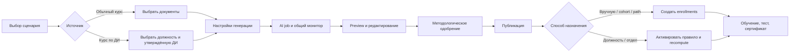

# Сравнение флоу обычного курса и курса по должностной инструкции

**Дата:** 20 июля 2026
**Роль:** методолог тенанта
**Область:** источник -> AI-генерация -> проверка -> публикация -> назначение -> обучение

## Краткий вывод

Оба сценария используют один AI-конвейер: Architect формирует структуру, Writer
пишет уроки, Assessment создаёт вопросы, затем результат сохраняется как native
course. Отличается не генерация как таковая, а управление источником и жизненным
циклом курса.

- Обычный курс имеет более зрелый authoring UX: выбор нескольких документов,
  аудитории, количества модулей и языка, подробный прогресс, предпросмотр,
  методологическое одобрение, регенерацию и AI-ассистента.
- Курс по ДИ имеет более зрелую доменную связь: текущая инструкция хранится как
  источник должности, курс помнит её версию, использует отдельный trial-лимит и
  автоматически связывается с должностью.
- После генерации оба сценария сходятся недостаточно хорошо. Публикация не
  является надёжным release gate, назначение допускает черновики, а learner
  dashboard не отфильтровывает неопубликованные курсы.
- Курс по ДИ нельзя считать полностью законченным флоу: для него жёстко заданы
  русский язык и три модуля, нет общего review-экрана, существующие сотрудники
  должности не получают новый курс автоматически, а при новой версии ДИ старый
  курс остаётся активным правилом должности.

Старый аудит от 16 июля описывает состояние до P0-реализации. Проблемы хранения
исходника, provenance курса, отдельного лимита и пустых черновиков уже исправлены.
Настоящий документ оценивает код после коммитов `82171b4`-`2f9e1ab`.

## Фактические флоу

### Обычный AI-курс

```text
/ai/generate
  -> загрузить или выбрать несколько general documents
  -> указать аудиторию, 1-10 модулей, RU/KK/EN
  -> POST /v1/ai/generate-course
  -> AIJob -> общий AI pipeline -> новый Course(draft)
  -> экран результата: preview, правки, AI-ассистент, review status
  -> отдельно открыть редактор или список курсов
  -> отдельно опубликовать
  -> вручную назначить обучающимся / связать с правилом
  -> learner flow -> тесты -> сертификат
```

### Курс по должностной инструкции

```text
/positions
  -> выбрать или создать должность
  -> загрузить current Document(category=job_instruction)
  -> проверить извлечённые обязанности и требования
  -> POST /v1/positions/{id}/generate-instruction-course
  -> заранее создать Course(draft) с source_instruction_id/version
  -> сразу создать PositionCourse(required=true)
  -> общий AI pipeline заполняет этот Course
  -> открыть обычный редактор курса
  -> отдельно опубликовать
  -> правило должности должно материализовать enrollments
  -> learner flow -> тесты -> сертификат
```

## Сравнительная таблица

| Этап | Обычный курс | Курс по ДИ | Оценка |
|---|---|---|---|
| Точка входа | Отдельный wizard `/ai/generate` | Карточка в длинном списке `/positions` | ДИ лучше привязан к задаче, но экран перегружен |
| Источник | Один или несколько общих документов | Ровно одна текущая ДИ должности | Корректное различие сценариев |
| Управление источником | Список, статус индексации, удаление; курс не хранит явный список версий источников | Скачать, заменить, статус индексации, связь Position -> Document -> Course | ДИ заметно сильнее по прослеживаемости |
| Проверка извлечения | Пользователь выбирает готовые документы, но не видит отдельного source review | AI обновляет обязанности/требования; методолог может открыть редактирование | Для ДИ нет обязательного подтверждения перед генерацией |
| Параметры | Аудитория, 1-10 модулей, RU/KK/EN | Аудитория = название должности, 3 модуля, RU; значения зашиты во frontend | Критическая UX-асимметрия |
| Trial | `ai_course_generations_used` | Отдельный `jd_course_generations_used` | Реализовано правильно |
| Создание курса | Course создаётся внутри pipeline | Draft создаётся заранее, получает provenance и PositionCourse | Модель ДИ лучше, но связь активируется слишком рано |
| Прогресс | Проценты, этапы, отмена, восстановление одного job через localStorage | Только статус pending/running/failed/completed в карточке; без процентов и отмены | Обычный flow существенно лучше |
| Результат | Preview структуры, inline lesson edit, регенерация, AI-ассистент, approve/needs changes | Ссылка сразу в общий редактор; AI-ассистент там есть, но review UX отсутствует | Нужно объединить |
| Публикация | Только отдельной кнопкой в списке `/courses` | То же | В обоих flow действие потеряно из контекста |
| Назначение | Ручное действие после review либо отдельные правила | `PositionCourse(required=true)` создаётся до завершения и публикации | Для ДИ автоматизация преждевременна |
| Уже работающие сотрудники | Получают курс при ручном назначении | Новый PositionCourse создаётся напрямую и не вызывает штатный recompute holders | Заявленная автоматизация неполна |
| Новые сотрудники | По ручному назначению/другому правилу | Получают все курсы, оставшиеся связанными с должностью | При версиях ДИ возможна выдача старого и нового курса |
| Обновление источника | Нет полноценной provenance/version модели | Новая ДИ помечает прошлый курс как outdated | Сильная сторона ДИ, но отсутствует корректная смена активной версии |
| Learner experience | После enrollment общий course flow | Тот же общий course flow | Для обучающегося различие не требуется |
| Результат обучения | Прогресс, тесты, training log, сертификат | То же | Унификация здесь правильная |

## Критические разрывы

### P0. Публикация не является границей доступности

`enroll_users` не проверяет `Course.status`. Rule-based assignment также не
проверяет статус курса. Student dashboard возвращает все enrollment rows вместе
с курсом и показывает `draft` так же, как `published`.

Последствия:

- обычный курс можно назначить сразу после review, хотя он ещё draft;
- курс по ДИ связывается с должностью ещё до завершения AI job;
- обучающийся может увидеть пустой или частично сформированный курс;
- unpublish не гарантирует скрытие курса от обучающихся;
- `GET /courses/{id}` проверяет tenant, но не опубликованность/enrollment для
  student, поэтому release boundary не выдерживается и на прямом URL.

**Решение:** сделать publication единым серверным activation gate.

1. Student видит и открывает только `published` course с действующим enrollment.
2. Ручное назначение draft запрещается понятной ошибкой.
3. Rule можно настроить заранее, но enrollment материализуется только после
   публикации.
4. `publish_course` проверяет непустую структуру, review status и тесты, затем
   активирует правила и выполняет fan-out.
5. Для unpublish нужна явная политика: скрыть новый старт, но не уничтожать
   завершённые результаты и сертификаты.

### P0. Автопривязка курса по ДИ обходит перерасчёт сотрудников

`generate_instruction_course` вставляет `PositionCourse` напрямую. Обычный
endpoint `attach_course_to_position` после такой вставки вызывает
`recompute_position_holders`, но DI endpoint этого не делает.

В результате:

- сотрудники, уже занимающие должность, не получают новый курс сразу;
- будущий импорт или ручной apply-rules может неожиданно «починить» ситуацию,
  из-за чего поведение выглядит случайным;
- интерфейс обещает автоматическое назначение сильнее, чем реализует backend.

**Решение:** не вызывать recompute при создании draft. Вызывать его после
успешной публикации через один общий assignment activation service.

### P0. Версии курса по ДИ накапливаются как одновременно обязательные

При замене ДИ создаётся новый Document и новый Course, но прежний
PositionCourse не деактивируется. Assignment kernel считает ожидаемым union всех
PositionCourse. Новый сотрудник поэтому может получить и старый, и новый курс.

**Решение:** ввести жизненный цикл правила, например
`PositionCourse.is_current/active_from/active_to`, либо отдельную сущность
`PositionCourseAssignmentPolicy`. При выпуске новой версии:

- старая версия перестаёт назначаться новым сотрудникам;
- `in_progress` можно оставить текущему сотруднику по выбранной политике;
- completed enrollment и сертификат всегда сохраняются;
- новый курс получают только сотрудники, для которых это действительно нужно;
- решение о переводе уже начавших обучение делает методолог, а не скрытая
  автоматика.

### P0. Обычный pipeline записывает автора курса как обучающегося

После standalone generation pipeline автоматически создаёт enrollment для
`user_id`, создавшего курс. В production это обычно methodologist/teacher, а не
student. Это противоречит разделению системных пользователей и обучающихся.

**Решение:** удалить production auto-enrollment автора. Для demo использовать
явный demo learner или отдельный preview-as-learner без Enrollment.

## UX-проблемы и улучшения

### P1. Один authoring workspace для двух источников

Не нужно делать два разных редактора. Нужен один компонент/маршрут создания
курса с параметром источника:

```text
CourseGenerationWorkspace
  sourceMode = general_documents | job_instruction
  sourceIds
  positionId?
  targetAudience
  language
  numModules
  quizSettings
  courseId?
```

Различается только первый шаг:

- general: выбрать несколько документов;
- job instruction: показать зафиксированную ДИ и должность без возможности
  случайно подмешать другие документы.

Остальные этапы должны быть одинаковыми: настройки, job progress, preview,
правки, approval, publish и activation.

### P1. Дать курсу по ДИ реальные настройки

Сейчас frontend отправляет `num_modules=3`, `language=ru`, а target audience
равен названию должности. Перед запуском нужен компактный dialog:

- язык курса: RU / KK / EN;
- количество модулей с рекомендацией по объёму ДИ;
- аудитория и уровень подготовки;
- проходной балл и число попыток;
- вариант: один язык или создать связанную RU+KK пару;
- понятный остаток отдельного trial-лимита.

Для RU+KK не следует переводить уже сгенерированный интерфейсный текст. Нужно
создать два связанных Course из одной версии источника, с отдельными уроками и
тестами на соответствующем языке.

### P1. Убрать потерянную публикацию

Сейчас review result предлагает «Назначить курс», хотя course может оставаться
draft, а publish находится в общем списке курсов.

Целевой footer после проверки:

1. `Сохранить черновик`;
2. `Одобрить`;
3. `Опубликовать и назначить` для общего курса;
4. `Опубликовать и активировать для должности` для курса по ДИ.

Каждая кнопка должна показывать последствия до выполнения: кому станет доступен
курс и сколько новых enrollments будет создано.

### P1. Единый серверный монитор AI jobs

Обычный flow восстанавливает только один `ai_active_job_id` из localStorage, а
DI flow выводит лишь агрегированный status внутри PositionResponse. Методолог
может одновременно запускать несколько генераций и уходить со страницы.

Нужен общий job center:

- все активные и последние AI jobs tenant;
- источник, курс, должность и инициатор;
- этап, проценты, время, ошибка и retry;
- переход к результату;
- отсутствие зависимости от localStorage конкретного браузера.

### P1. Отдельная карточка должности вместо mega-page

`/positions` должен оставаться списком и показывать статус цепочки. Детальную
работу следует перенести в `/positions/{id}` с вкладками:

1. Обзор;
2. Должностная инструкция;
3. Курс и проверка знаний;
4. Назначения и результаты;
5. История версий.

Это особенно важно для замены ДИ: методолог должен видеть текущую и прошлую
версии, активный курс и влияние обновления на сотрудников.

### P1. Обязательное подтверждение распознанной ДИ

Статус embedding `success` означает только техническую готовность источника. Он
не означает, что AI правильно распознал обязанности и требования.

Добавить отдельный domain status:

```text
uploaded -> processing -> extracted -> reviewed -> approved
```

Кнопка генерации доступна после `approved`. Экран review показывает исходный
фрагмент рядом с извлечённым полем и сохраняет автора/дату подтверждения.

### P2. Общая provenance-модель

Для ДИ Course хранит source id и timestamp. Для обычного курса список исходных
документов остаётся в параметрах AIJob и не является устойчивой доменной
связью.

Добавить `course_sources`:

| Поле | Назначение |
|---|---|
| `course_id` | курс |
| `document_id` | исходный документ |
| `document_version_at` | версия при генерации |
| `source_kind` | general / job_instruction |
| `is_primary` | основной источник |

Это даст обычным курсам те же возможности: показать источники, обнаружить
устаревание, провести регенерацию и объяснить происхождение контента.

## Целевой унифицированный flow



## Рекомендуемый порядок внедрения

### Этап 1 — целостность release-flow, P0

1. Закрыть student-доступ к draft и чужому enrollment.
2. Запретить ручное и rule-based назначение неопубликованных курсов.
3. Удалить auto-enrollment автора AI-курса.
4. Централизовать `publish -> validate -> activate rules -> recompute`.
5. Добавить тесты на draft visibility, publication, current holders и RBAC.

### Этап 2 — корректные версии ДИ, P0/P1

1. Ввести active/current lifecycle связи должность-курс.
2. Зафиксировать политику для ongoing enrollments при новой версии.
3. Показывать preview количества затронутых сотрудников перед activation.
4. Не выдавать старый и новый курс новым сотрудникам одновременно.

### Этап 3 — единый authoring UX, P1

1. Вынести общие generation/progress/review компоненты из `/ai/generate`.
2. Подключить их к job-instruction mode.
3. Добавить язык, объём, аудиторию и quiz settings для ДИ.
4. Перенести publish/activate в завершение review.
5. Сделать серверный job center.

### Этап 4 — lifecycle и provenance, P1/P2

1. Создать `/positions/{id}`.
2. Добавить review/approval извлечённой ДИ.
3. Ввести `course_sources` для обычных курсов.
4. Реализовать controlled regeneration и RU+KK course pair.

## Критерии готовности

- Ни один student не видит draft ни в списке, ни по прямому URL.
- Нельзя создать enrollment на draft через UI или API.
- Публикация курса по ДИ одним действием назначает его всем подходящим текущим
  сотрудникам и будущим сотрудникам должности.
- Новая версия курса заменяет активное правило для новых сотрудников, не удаляя
  историю завершивших и не сбрасывая прогресс без решения методолога.
- Обычный и DI flow используют одинаковый progress/review/publish UX.
- Для обоих типов курса можно доказать, из каких документов и версий создан
  контент.
- Методолог не появляется в списке обучающихся из-за создания курса.
